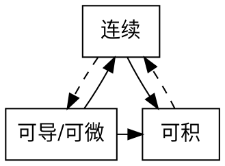

## 微积分核心

<b> 领域 </b>：距 $x_0$ 的较近的范围，在该区间研究函数极限连续等问题
&emsp; <strong> $x_0$ 的去心邻域 </strong>：$\mathring{U}(x_0, \sigma) = \{x \big| 0 < |x - x_0| < \sigma\}$

注

下列讨论是不严格的，因为为方便记忆，忽略了函数 $f(x)$ 是否在 $x_0$ 的邻域（或去心领域）上有定义等前提条件

 

<b> 极限 </b>：$\epsilon - \sigma$ 语言：$\forall\epsilon > 0$，$\exists\sigma > 0$，当 $0 < |x - x_0| < \sigma$ 时，有 $|f(x) - A| < \epsilon$
&emsp; 记作：$\displaystyle \lim_{x \to x_0}f(x) = A$
极限的性质：... 另：条件添上

<b> 连续 </b>：$\displaystyle \lim_{x \to x_0}f(x) = f(x_0)$

<b> 导数和微分 </b>：对任何微小增量 $\Delta x$，有：
&emsp; 导数：$\displaystyle f'(x) = \lim_{\Delta x \to 0}\frac{f(x_0 + \Delta x) - f(x_0)}{\Delta x}$
&emsp; 微分：$df(x) = A\Delta x + o(\Delta x)$
&emsp; 导数与微分关系：$df(x) = f'(x)dx$
<!-- 需要补图 -->
+ 微分中值定理：$f(x)$ 两端连线的斜率 等于 区间内某一点的导数
&emsp; 若 $f(x)$ 在 $[a,b]$ 上连续，$(a,b)$ 内可导，则：$\exists \epsilon \in (a,b)$，使 $f(\epsilon) = \dfrac {f(b) - f(a)}{b - a}$

<b> 积分 </b>：$\displaystyle \int_a^bf(x)dx = \lim_{\lambda \to 0}\sum_{i = 1}^n f(\epsilon_i)(x_i - x_{i-1})$
<!-- 需要补图 -->
+ 积分中值定理：$f(x)$ 曲边梯形的面积 等于 区间内某一点作高围成的长方形面积
&emsp; 若 $f(x)$ 在 $[a,b]$ 上连续，则：

<b> 连续，可导/可微与可积的关系 </b>：

渐进线？

多元函数微分

二重积分

微分方程
